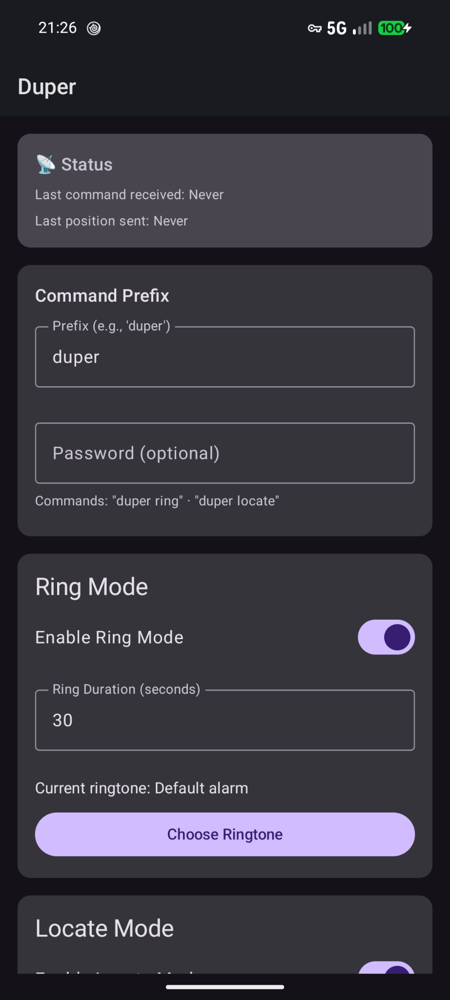
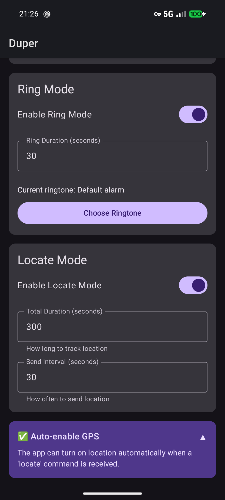

# Duper

Android app to find your phone remotely via SMS commands.

> **Why "Duper"?** It's French *verlan* (slang made by reversing syllables) for *perdu* → **du-per**. *Perdu* means "lost" in French. You get it.

|  |  |
| :---: | :---: |
|  |  |   
| | |
## Features

- **Remote Ring** – Trigger alarm and LED flash at max volume
- **Remote Locate** – Get GPS coordinates via SMS
- **SMS-Based** – No internet required on target device
- **Customizable** – Set your own command prefix and password
- **Auto-GPS** – Optionally enable location services automatically (requires ADB setup)

## Quick Start

1. Download latest APK from [Releases](https://github.com/sudo-tiz/Duper/releases)
2. Install and grant SMS/Location permissions
3. Set your command prefix and optional password in settings
4. From another phone, send: `<prefix> ring [password]` or `<prefix> locate [password]`

## Commands

| Command | Action |
|---------|--------|
| `<prefix> ring [password]` | Triggers alarm |
| `<prefix> locate [password]` | Sends GPS coordinates via SMS |

## Permissions

- **SMS** – Receive commands, send responses
- **Location** – GPS tracking
- **Camera/Flashlight** – Visual alert
- **Background Location** – Track when app is closed (optional but recommended)

## Auto-Enable GPS (Optional)

If your phone's location services are turned off, the locate command will fail by default.
Duper can automatically enable location services if you grant it a special permission via the Android Debug Bridge (ADB).

```sh
adb shell pm grant fr.sudotiz.duper android.permission.WRITE_SECURE_SETTINGS
```

Requires USB debugging enabled. One-time setup.

## Building

```sh
git clone https://github.com/sudo-tiz/Duper.git
# Open in Android Studio and build
```

## License

GPL-3.0 – See [LICENSE](LICENSE)
