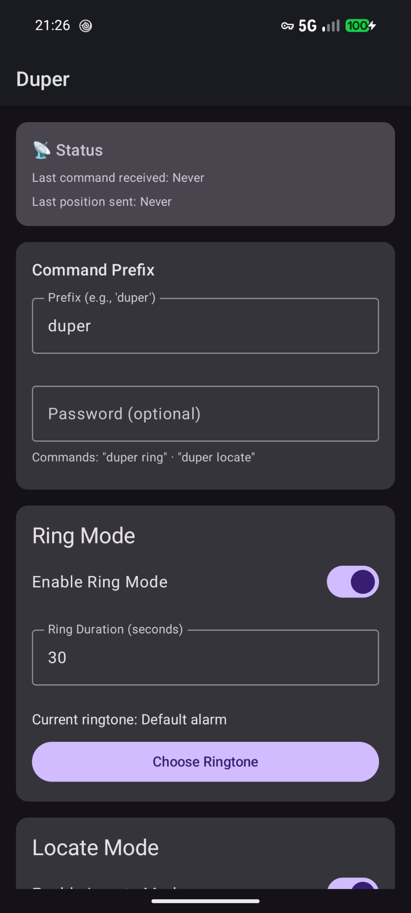
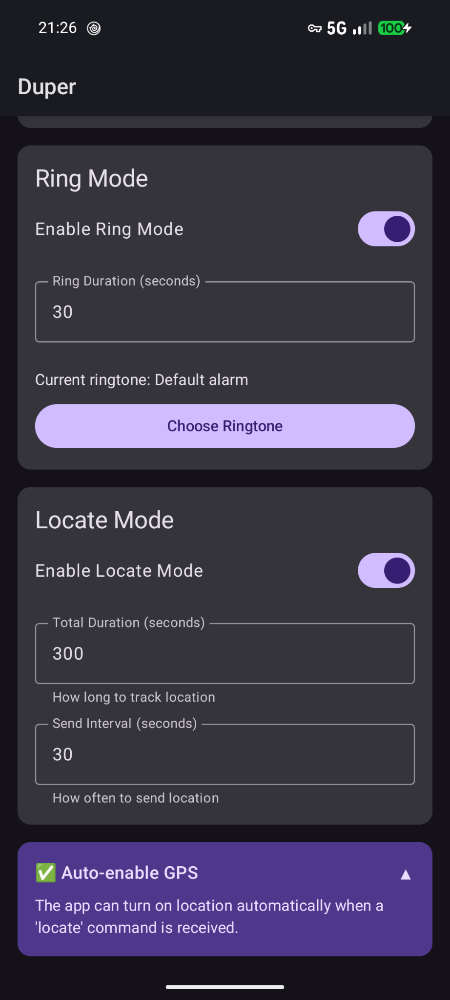

# Duper

**Lost your phone? Send it "duper".**

Android app to find your phone remotely via SMS commands.
[](https://f-droid.org/packages/fr.sudotiz.duper)

> **Why "Duper"?** It's French *verlan* (slang made by reversing syllables) for *perdu* → **du-per**. *Perdu* means "lost" in French. You get it.

|  |  |
| :---: | :---: |
|  |  |   
| | |

## Features

- **Remote Ring** – Trigger alarm and LED flash at max volume
- **Remote Locate** – Get GPS coordinates via SMS
- **SMS-Based** – No internet required on target device
- **Customizable** – Set your own command prefix and optional password
- **Auto-GPS** – Optionally enable location services automatically (requires ADB setup)


## Quick Start

1. Download latest APK
    - [Releases](https://github.com/sudo-tiz/Duper/releases)
    - [F-Droid](https://f-droid.org/packages/fr.sudotiz.duper)
2. Enable Ring or Locate in the app and grant only the requested permissions
3. From another phone, send a configured command


## Commands

| Command | Action |
|---------|--------|
| `<prefix>` or `<prefix> ring` | Triggers alarm when Ring Mode is enabled and no Ring password is set |
| `<prefix> <ring-password>` or `<prefix> ring <ring-password>` | Triggers alarm when Ring Mode is enabled and a Ring password is set |
| `<prefix> locate <locate-secret>` | Sends GPS coordinates via SMS when Locate Mode is enabled |

Ring and Locate are disabled by default. The command prefix must be one word. Ring can use an optional case-sensitive password and optional SMS confirmation. Locate requires its own non-empty, case-sensitive secret and sends SMS responses.
For privacy, remote commands only run while the phone is locked. A command received while it is unlocked is refused without an SMS reply.

## Permissions

- **SMS** – Requested when enabling Ring or Locate to receive commands and send responses
- **Camera** – Requested when enabling Ring to control the device torch; Duper does not capture photos or video
- **Location** – Requested when enabling Locate for GPS tracking
- **Background Location** – Requested when enabling Locate to track when the app is closed
- **Notifications** – Optional; shows accepted or refused command attempts on the target phone

## Privacy

Duper has no account, server, tracking SDK, or internet permission. Its secrets, settings, command history, and last location are stored only on the device and are excluded from Android backup and device-transfer data.

Ring uses Android's alarm audio stream. Device and Do Not Disturb policies may still limit alerts; optional Do Not Disturb support is planned.

### ⚠️ Android 15+ Note 
> Android 15+ blocks SMS permissions by default.

If the SMS toggle is greyed out:
1. Go to **Settings > Apps > Duper**.
2. Tap the **three-dot menu (⋮)** in the top-right corner.
   *(Note: On some devices, you may need to tap "Permissions" first to see this menu).*
3. Select **Allow restricted settings**. 
4. Return to **Permissions** and grant **SMS** access.

## Auto-Enable GPS (Optional)

If your phone's location services are turned off, the locate command will fail by default.
Duper can automatically enable location services if you grant it a special permission via the Android Debug Bridge (ADB).

```sh
adb shell pm grant fr.sudotiz.duper android.permission.WRITE_SECURE_SETTINGS
```

Requires USB debugging enabled. One-time setup.

`WRITE_SECURE_SETTINGS` is an optional privileged permission. It cannot be granted through the normal Android permission screen and is not required to use Duper when location services are already enabled.

## Roadmap

- [x] Secure remote commands: opt-in modes, separate Locate secret, optional Ring password, and locked-device-only execution.
- [x] Privacy protection: disable backups and device transfers; remove unused permissions.
- [x] Store metadata: update Fastlane descriptions and add initial screenshots.
- [ ] Sender blocking: local normalized blacklist with add, edit, search, paste, and removal.
- [ ] Optional Do Not Disturb support without making Ring depend on the access.
- [ ] Import/export: UTF-8 blacklist files through the system document picker, with import preview and validation.

## License

GPL-3.0 – See [LICENSE](LICENSE)
